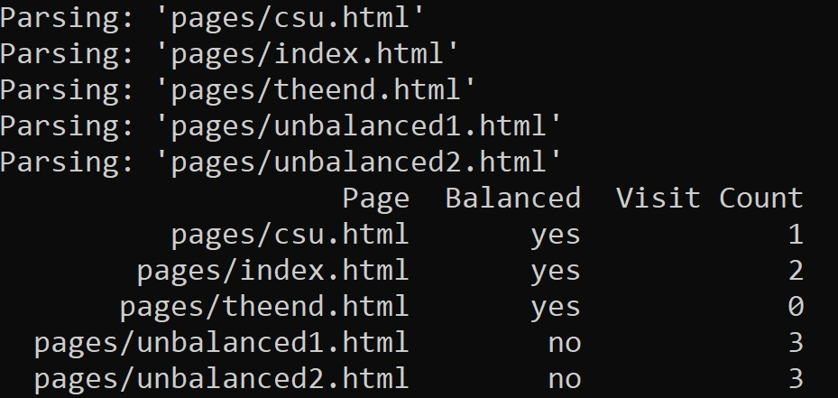

Portfolio
=========
---

## About Me

Coder. Cat dad. Car nut.

I'm a full-stack developer focused on mastering my craft one language at a time. The projects in this portfolio are some of my favorite works from my time pursuing my B.S. in Computer Science.

	

		<b>
			Read more about my journey here:
		</b>
	

	

		&emsp;&emsp;When I first started coding, I was just an auto-glass installer with a passion for Skyrim. I was 27, I finally had a decent PC, and I had ideas for improvements, so I began to learn how to mod the game to meet those goals. Over the following 3 years, I learned about directories, file types, and managing installations. When the Covid-19 pandemic hit, I had come to realize that I had a passion for computing, so I enrolled for my A.S. in Network Systems Management while working full time. When I started networking, it clicked in me that I could do this. I finished my A.S. in a single year, graduating with a 4.0 exactly one year after starting. Near the end of that process, I came upon the opportunity to study for my B.S. in Computer Science, and again, I knew I could do it, so I did. Just two and a half years later, I have my B.S. in Computer Science. Over that time I sought to develop as many skills as possible, taking on projects above and beyond my capabilities to push myself. When I had projects in HTML, I studied MERN and MEAN stacks. When I had the opportunity to begin my Senior Project, I went out of my way to choose Rust as my primary language, because learning something beyond what was taught was that important to me. That's all to say nothing of my private study of Python, Typescript, C and C#, even Perl. I am passionate about this; Software Development is my dream, and I will not stop pursuing and honing my skills.
	

 
“A good programmer is someone who always looks both ways before crossing a one-way street.” - Doug Linder

---

## 🏗️ Languages and Frameworks

 

and more!

---

## Programming Projects

*For access to my private project repositories, please [email me](mailto:example@csustudent.net?subject=GitHub%20Access) with the subject line "GitHub Access".

---
### [Prometheus | CSU Senior Project](project1)

---
### [Prometheus Website | CSCI 434 - Human-Computer Interaction](project2)

---
### [UDP Client/Server | CSCI 330 - Applied Networking](project3)

---
### [Calendar Command Line Interface | CSCI 325 - Object-Oriented Programming](project4)

---
### [HTML Parser | CSCI 315 - Data Structures](project5)

---

Ethics Papers
-------------

### [Morality of Memes: The Ethical Enforcement of Consent](/papers/Morality_of_Memes.pdf)

-   **Class: CSCI 330 - Computer Architecture**  
-   **Grade: 100%**

### [Unions in Tech: Securing Worker's Rights in Computing](/papers/Unions_in_Tech.pdf)

-   **Class: CSCI 325 - Object-Oriented Programming** 
-   **Grade: 100%**

### [Left not Right: The Ethics of Licensing in Computer Science](/papers/Left_not_Right.pdf)

-   **Class: CSCI 301 - Survey of Scripting Languages** 
-   **Grade: 100%**

---

Presentations
-------------

### [Prometheus Project Presentation](/presentations/Prometheus_Presentation.pdf)
watch [here!]((https://www.youtube.com/watch?v=PxdCKYLUaLY&list=PLQX6zsXm88a2xmYZmv2DPMdrvniJ2S-jd&index=4)

- **Class: CSCI 499 - Senior Project** 
- **Grade: 94%**

### [Prometheus Website User Testing](/presentations/Prometheus_Website_User_Testing.pdf)
watch [here!](/presentations/Prometheus_Website_User_Testing.mp4)

- **Class: CSCI 434 - Human-Computer Interaction** 
- **Grade: 100%**

### [The ALU and You!](/presentations/The_ALU_and_You.pdf)
watch [here!](/presentations/The_ALU_and_You.mp4)

- **Class: CSCI 330 - Computer Architecture** 
- **Grade: 100%**

---

Page template forked from <a href="https://github.com/csu-cs/CSCI -portfolio">CSU-CS</a>

<!-- Remove above link if you don't want to attributive -->
