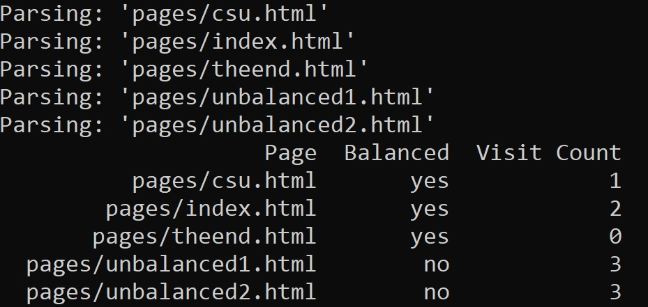

[Back to Portfolio](./)

HTML Parser
===============

-   **Class: CSCI 315 - Object Oriented Programming** 
-   **Grade: 95%** 
-   **Language(s): C++** 
-   **Source Code Repository:** [CSCI 315 - Data Structures](https://github.com/RicoNoSuave/CSCI315-Data_Structures)  
    (Please [email me](mailto:Ricardo.E.Harris@gmail.com?subject=GitHub%20Access) to request access.)

## Project description

This is an HTML Parser project built in C++ to demonstrate a mastery of principles of Data Structures in programming. This project takes a folder of HTML files and tells the user if each page is balanced and how many unique, valid sites can be visited from said page.

## How to compile and run the program

The file has a makefile, so to compile and run the project, run:

```bash
make run;
```

## UI Design

When running the program, the command line will update the user which page is being parsed at any given time. Afterwards, there will be a rudimentary table listing the pages, whether they are balanced, and the number of unique viable links in that page (see Fig 1).

  
Fig 1. Program Output.

## 3. Additional Considerations

If you wish to add more pages to the parser for checking, just add them to the ```pages/``` directory, and write the titles into the makefile under the ```given:``` flag.

[Back to Portfolio](./)
